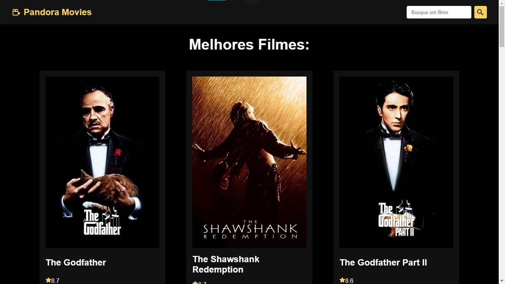
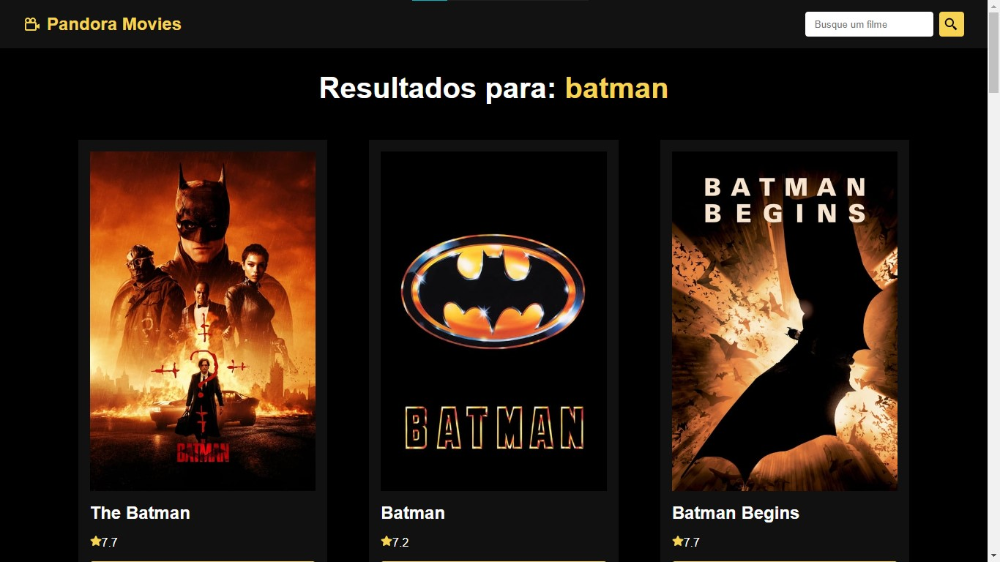

# Pandora Movies
Study on the API TMDB

<h2>Home:</h2>

 

<h2>Busca:</h2>

 

<h2>Detalhes do filme:</h2>

 

In the project directory, you can run:

### `npm run dev`

Runs the app in the development mode.